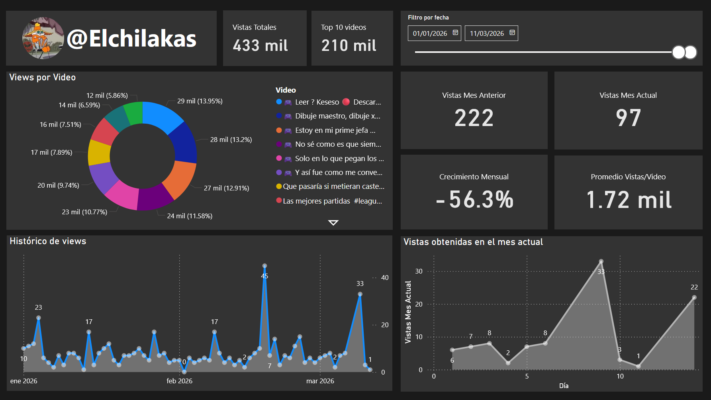

# YouTube Analytics ETL & Power BI Dashboard

[](https://www.python.org/)
[](https://www.sqlite.org/index.html)
[](https://powerbi.microsoft.com/)

---

## Table of Contents
1. [Overview](#overview)
2. [Features](#features)
3. [Tech Stack](#tech-stack)
4. [Prerequisites](#prerequisites)
5. [Installation](#installation)
6. [Power BI Gateway Setup](#power-bi-gateway-setup)
7. [Usage Options](#usage-options)
8. [Screenshots](#screenshots) 
9. [Future Scope (Roadmap)](#future-scope-roadmap)

---

## Overview
As a YouTube content creator, tracking detailed month-over-month growth using the native YouTube Studio can be time-consuming and cluttered with excessive data. This project solves that problem by automating the extraction and transformation of key performance indicators (KPIs) into a local database, which is then seamlessly connected to a rich, highly interactive Power BI dashboard.

It automatically fetches daily metrics, stores them locally, and uses Power BI to provide a visually stunning and focused view of channel growth, top-performing videos, and historical trends. The visual impact and interactive filtering capabilities of Power BI significantly outclass standard Python-based web UI frameworks.

---

## Features
* **Automated Data Extraction:** Connects to YouTube Data API v3 and YouTube Analytics API v2.  
* **Local Persistence:** Uses SQLite to maintain a historical record of channel statistics without relying on constant API calls.  
* **Advanced Visualizations:** A fully decoupled presentation layer using Power BI, offering superior UI aesthetics, cross-filtering, and dynamic tooltips.
* **Automated Refresh via Gateway:** Data synchronization from the local SQLite database to the Power BI Cloud Service is handled natively by the Power BI Gateway.
* **Background ETL Execution:** Run the Python data pipeline continuously in the background or trigger it via Windows Task Scheduler.

---

## Tech Stack
* **Language:** Python 3.14.0  
* **Data Handling:** Pandas, Pydantic  
* **Database:** SQLite3  
* **UI/Visualization:** Microsoft Power BI  
* **Authentication:** Google OAuth 2.0 (`google-auth-oauthlib`)  
* **Architecture:** Decoupled ETL (Extract, Transform, Load)  

---

## Prerequisites
This application uses Google OAuth 2.0 for data retrieval and Power BI for visualization. 

1. **Google Cloud Credentials:** Obtain your OAuth 2.0 Client IDs from Google Cloud and place the downloaded JSON file at: `credentials/google_credentials.json`.  
2. **Power BI Desktop:** Required to open and publish the `.pbix` dashboard file.
3. **Power BI Standard/Personal Gateway:** Required to keep the published cloud dashboard synchronized with your local SQLite database.

*(Note: As this is currently an unpublished test app, Google credentials are restricted. Recruiters or evaluators may request test access directly from the author).*
---

## Installation

1. Clone the repository:
   ```bash
   git clone https://github.com/yourusername/youtube-analytic-dashboard.git
   cd youtube-analytic-dashboard
   ```
2. Create and activate your virtual environment (optional but recommended):
   ```bash
   python -m venv venv
   source venv/bin/activate  # Linux/Mac
   venv\Scripts\activate     # Windows
   ```
3. Install dependencies:
   ```bash
   pip install -r requirements.txt
   ```

---

## Usage Options

### Option 1: Scheduled Terminal Process
You can run the application in a terminal to act as a daemon. By default, it will trigger the ETL process daily at **11:00 AM**.

```bash
python main.py --scheduled
```

### Option 2: Standalone Execution (Windows Task Scheduler)
For personal computer use, avoiding an open terminal is preferred. The app can be compiled into a `.exe` (using PyInstaller) and triggered via Windows Task Scheduler.

Running the executable without the `--scheduled` flag will immediately run the ETL process, update the SQLite database, and launch the Streamlit dashboard in your default browser.

```bash
# To run the raw script immediately:
python main.py
```

---

## Screenshots

Here are some screenshots of the YouTube Analytics dashboard in action:

### Running on terminal for first time


### Asking for google access with 2.0 Auth


### Dashboard



### Code & running on scheduled mode


---

## Future Scope (Roadmap)
- **Database Migration:** Transition from SQLite to PostgreSQL for more robust, concurrent data handling.  
 

