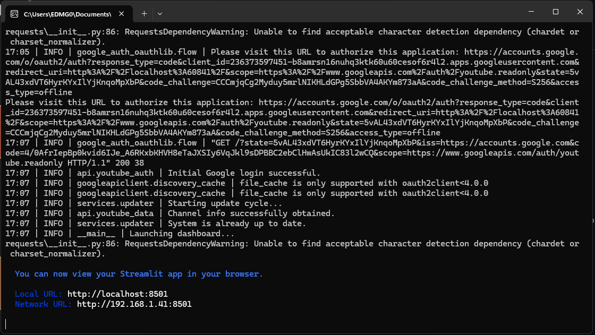
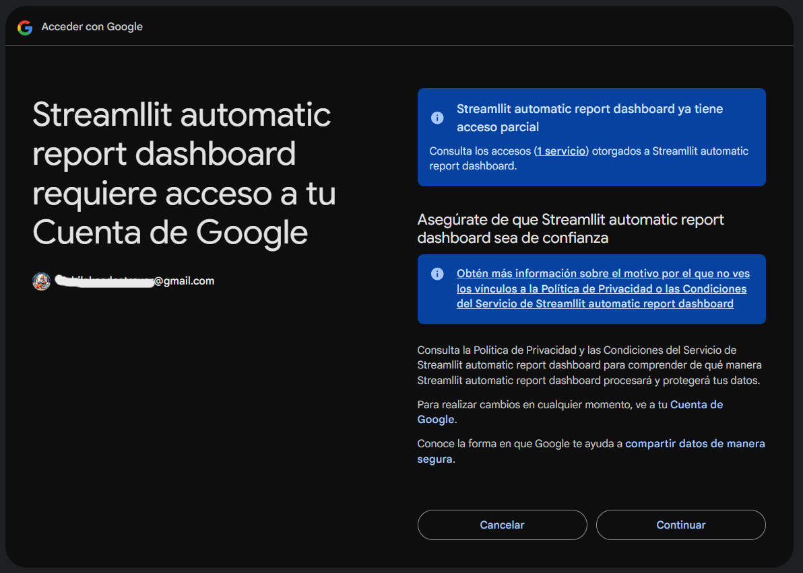
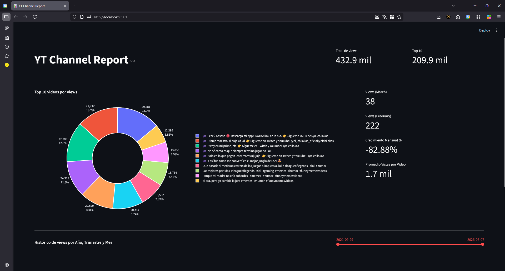
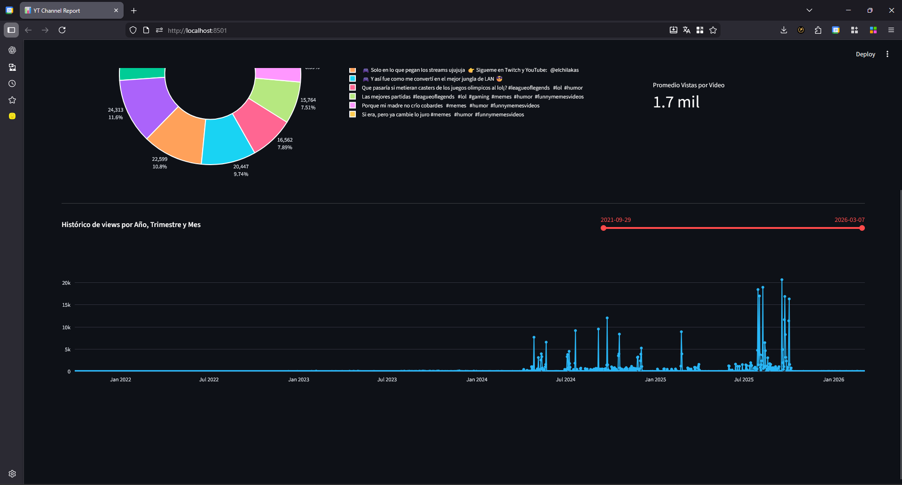
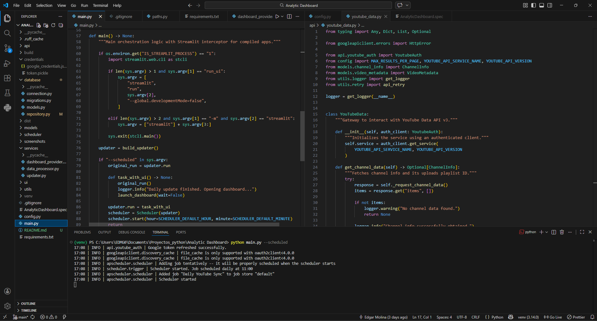

# YouTube Analytics ETL & Dashboard

[](https://www.python.org/)
[](https://www.sqlite.org/index.html)
[](https://streamlit.io/)

---

## Table of Contents
1. [Overview](#overview)
2. [Features](#features)
3. [Tech Stack](#tech-stack)
4. [Prerequisites](#prerequisites)
5. [Installation](#installation)
6. [Usage Options](#usage-options)
   - [Option 1: Scheduled Terminal Process](#option-1-scheduled-terminal-process)
   - [Option 2: Standalone Execution (Windows Task Scheduler)](#option-2-standalone-execution-windows-task-scheduler)
7. [Screenshots](#screenshots) 
8. [Future Scope (Roadmap)](#future-scope-roadmap)

---

## Overview
As a YouTube content creator, tracking detailed month-over-month growth using the native YouTube Studio can be time-consuming and cluttered with excessive data. This project solves that problem by automating the extraction, transformation, and visualization of key performance indicators (KPIs) into a clean, intuitive Streamlit dashboard.

It automatically fetches daily metrics, stores them locally in a database, and provides a focused view of channel growth, top-performing videos, and historical trends.

---

## Features
* **Automated Data Extraction:** Connects to YouTube Data API v3 and YouTube Analytics API v2.  
* **Local Persistence:** Uses SQLite to maintain a historical record of channel statistics without relying on constant API calls.  
* **Passive View Dashboard:** A Streamlit UI decoupled from the business logic, presenting clean visualizations (Donut charts, Area charts) using Plotly.  
* **Dual Execution Modes:**
  - Run continuously in the background using an internal scheduler.  
  - Execute as a standalone application via Windows Task Scheduler.  

---

## Tech Stack
* **Language:** Python 3.14.0  
* **Data Handling:** Pandas, Pydantic  
* **Database:** SQLite3  
* **UI/Visualization:** Streamlit, Plotly  
* **Authentication:** Google OAuth 2.0 (`google-auth-oauthlib`)  
* **Architecture:** Decoupled ETL (Extract, Transform, Load)  

---

## Prerequisites
This application uses Google OAuth 2.0. To run it locally, you need a `google_credentials.json` file from the Google Cloud Console with permissions for the YouTube Data and Analytics APIs.

1. Obtain your OAuth 2.0 Client IDs from Google Cloud.  
2. Place the downloaded JSON file at: `credentials/google_credentials.json`.  
*(Note: As this is currently an unpublished test app, credentials are restricted. Recruiters or evaluators may request test access directly from the author).*

---

## Installation

1. Clone the repository:
   ```bash
   git clone https://github.com/yourusername/youtube-analytic-dashboard.git
   cd youtube-analytic-dashboard
   ```
2. Create and activate your virtual environment (optional but recommended):
   ```bash
   python -m venv venv
   source venv/bin/activate  # Linux/Mac
   venv\Scripts\activate     # Windows
   ```
3. Install dependencies:
   ```bash
   pip install -r requirements.txt
   ```

---

## Usage Options

### Option 1: Scheduled Terminal Process
You can run the application in a terminal to act as a daemon. By default, it will trigger the ETL process daily at **11:00 AM**.

```bash
python main.py --scheduled
```

### Option 2: Standalone Execution (Windows Task Scheduler)
For personal computer use, avoiding an open terminal is preferred. The app can be compiled into a `.exe` (using PyInstaller) and triggered via Windows Task Scheduler.

Running the executable without the `--scheduled` flag will immediately run the ETL process, update the SQLite database, and launch the Streamlit dashboard in your default browser.

```bash
# To run the raw script immediately:
python main.py
```

---

## Screenshots

Here are some screenshots of the YouTube Analytics dashboard in action:

### Running on terminal for first time


### Asking for google access with 2.0 Auth


### Dashboard



### Code & running on scheduled mode



## Future Scope (Roadmap)
- **Database Migration:** Transition from SQLite to PostgreSQL for more robust, concurrent data handling.  
- **BI Integration:** Explore a direct connection to Microsoft Power BI as an alternative presentation layer to Streamlit.  
- **Advanced Error Resilience:** Implement a more robust retry algorithm (e.g., Tenacity) for edge-case network failures during API requests.

